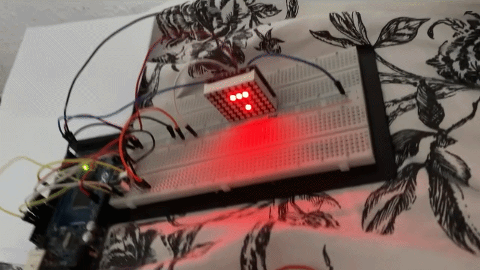
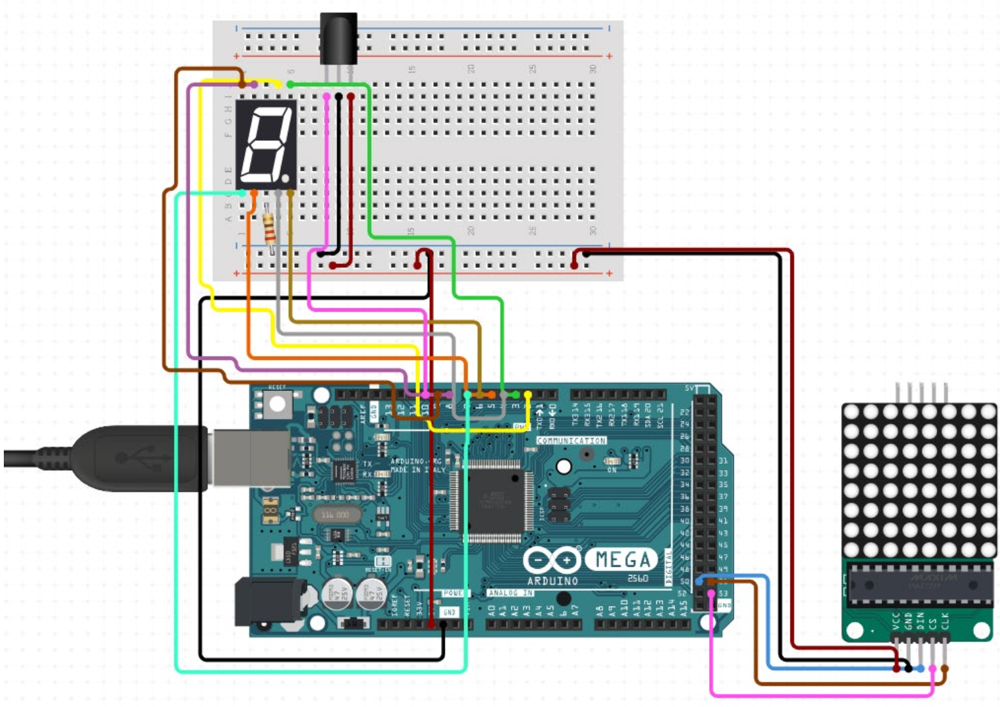

# Snake On Arduino - An Arduino Based Snake Game

This project developed the classical Snake game on a 8x8 LED Matrix. The project was one of the many projects in the Technology B (Teknologi B) subject at Danish high school (HTX).
The project was given the grade 12 (A).

## Setup
  
The wiring schematic of the project can be seen above. 

## Project Materials
- Arduino Mega
- 8x8 LED Dot Matrix
- MAX7219 IC
- Sevensegment display
- IR Controller (TV Remote)
- IR sensor
